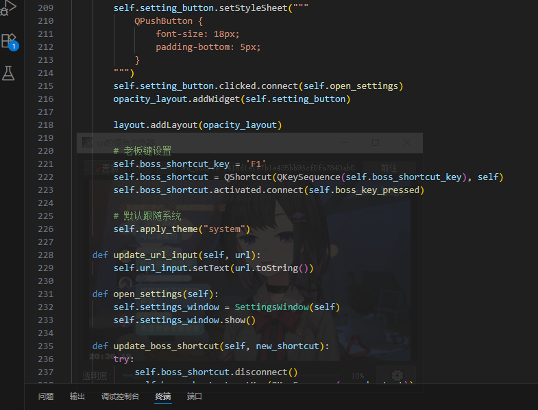
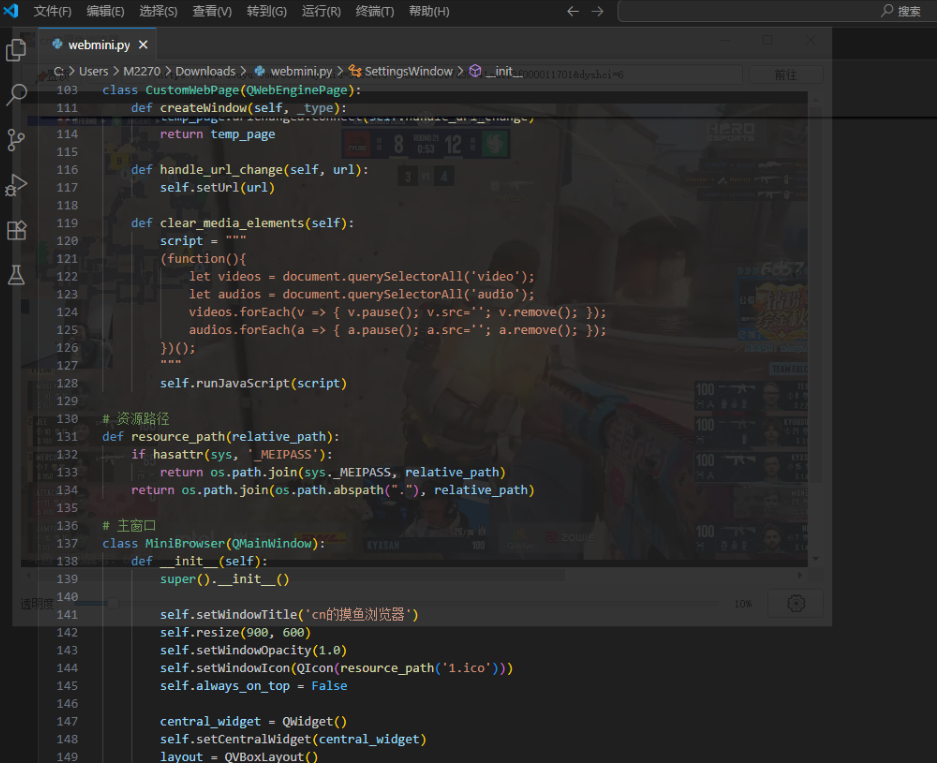

# MoyuBrowser 🐟 轻巧的摸鱼浏览器

> 一个专为摸鱼设计的小窗浏览器，可调透明度、支持老板键隐藏，最重要的是小窗口不会非要置顶。  
> 写这个浏览器是因为 Chrome 的小窗视频不能取消置顶，摸鱼差点被老板发现:(  
> 这个readme由gpt生成
---

## ✨ 功能亮点

- 🖥️ **小巧浏览窗口**  
  适合看片 / 看直播 / 摸鱼时使用，占地不大，不惹眼。

- 📌 **可选置顶 / 取消置顶**  
  不像 Chrome 一样强制置顶！

- 🌫️ **可调节窗口透明度**  
  拉动滑条，窗口就能隐隐约约～低调到几乎看不见！

- 🎹 **老板键一键隐藏（默认 F1）**  
  摸鱼不留痕迹 
  你也可以自己设置喜欢的快捷键。

- 🎨 **深色 / 浅色 / 跟随系统主题**  
  自带主题切换，适配电脑的白天 / 夜晚氛围

- ⚙️ **内置设置界面**  
  可以修改老板键，也能选择主题模式。

---

## 🎥 关于视频播放支持

Qt 默认的 QWebEngineView  **不支持 HTML5 标签的视频**，会导致Bilibili、YouTube 等平台的视频播放失败，直播流、嵌入视频也可能加载不了等

为了支持这些视频格式，使用了**重新编译过的 Qt WebEngine 动态链接库**（以下文件已替换）：

- Qt5WebEngineCore.dll
- Qt5WebEngineWidgets.dll

不过这两个动态库都是x86的，所以发布的是x86版本的，要是有人能编译一个x64的给我就好了（

## 示例

